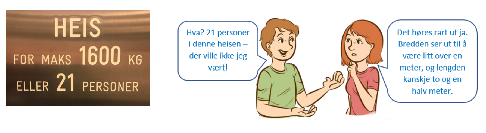
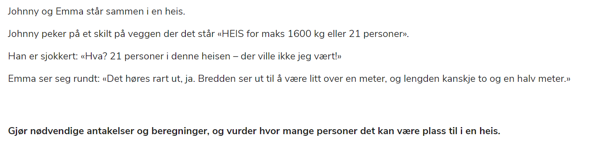

# Eksempel på type3-oppgave med løsningsforslag

## Løsningsforslag

### Mine notater som jeg bruker mens jeg tenker

| Spør deg selv: | Mulige svar/refleksjoner|
|:---|:---|
| Hva spør oppgaven om?  Hva er det jeg skal finne en løsning på? | Hvor mange personer er det plass til i en heis	  |
| Hva vet jeg? |  - Heisen er 1x2,5 meter = 100x250 cm  - Heisen rommer maks 21 personer  - Heisen tar maks 1600 kg  |
| Kan jeg bruke det jeg vet til å løse oppgaven? Er det eventuelt informasjon som jeg mangler? _Kan jeg gjøre antakelser/ forutsetninger_? |  Min første antagelse er at det er normale tilstander i samfunnet og at en ikke trenger å holde 1 meter avstand til andre (skrevet under korona-tida).  - Videre tenker jeg at alle menneskene jeg skal plassere i heisen er ca like store og av gjennomsnittlig størrelse.  - Når man skal dekke et bord, beregner man at hver kuvert er på 60cm. Da har man god plass. Jeg antar derfor at et menneske er ca 50cm bredt, og 50 cm "dypt". På en skisse vi jeg tegne hver person som en firkant på 50x50cm |
| Hvilke resultater gir dette? Er det noe som skiller seg ut som det er verdt å bemerke? |	Hvis jeg tenker at et menneske er 50x50cm går det to mennesker i bredden og 5 mennesker i lengden. Til sammen blir dette 10 mennesker i heisen   |
| Hvordan kan jeg presentere resultatene mine? (Tabell, Graf, Diagram, Formel, Modell, Regresjon, Annet? |	Jeg kan lage en skisse eller tegning   |

### NB
Det er ikke slik at hele denne tabellen er svar på oppgaven. Selve tabellen er en hjelp for deg underveis i svaret på oppgaven og når du skal skrive det endelige løsningsforslaget. 
 
Selve svaret på oppgaven bør utarbeides etter PDB-metoden (Påstand, Data, Begrunnelse). 
_DET ER DELEN UNDER HER SOM SKAL LEVERES INN!_

## Innlevering
### PÅSTAND: 	
Det er plass til 10 personer i heisen
 
### DATA: 	
Jeg antar at samfunnet er i normaltilstand og at det ikke er avstandsrestriksjoner mellom mennesker, altså kan 	man i heisen stå så tett man ønsker. Jeg antar også at alle i heisen er ca. like store. Dette gjør det enklere å 	regne med. 
 
	Når man skal dekke et bord, beregner man at hver kuvert er på 60 cm. Som regel har man god plass da. Jeg 	antar derfor at en person er mindre enn 60 cm, og tenker at 50 cm er et fint gjennomsnitt. Jeg antar også at en 	person er ca. like "dyp", at det altså ikke spiller noen rolle om hvilken retning personen står i. Dette fordi ingen 	liker å stå så tett at man i prinsippet har nesen sin i naboens hår. 

### BEGRUNNELSE:
Heisen er 100x250 cm, altså er det plass til to personer i bredden og 5 i lengden. Totalt blir dette 10 personer 	i heisen. Se figur 1 for skisse.