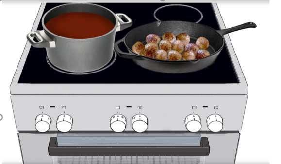
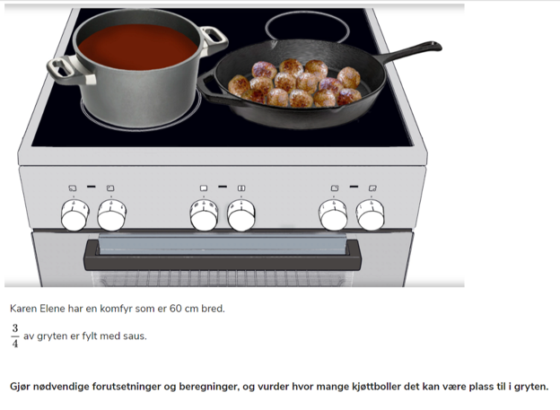

# Kjøttboller; oppgavetekst

- Hvor breid er en komfyr?
- Hvilken fasong har ei gryte? Hvorfor?
- Hvor stor er ei kjøttbolle?
- Hvor stor er kokeplata? 
- Er alle kokeplatene like store?

## Oppgavetekst:
