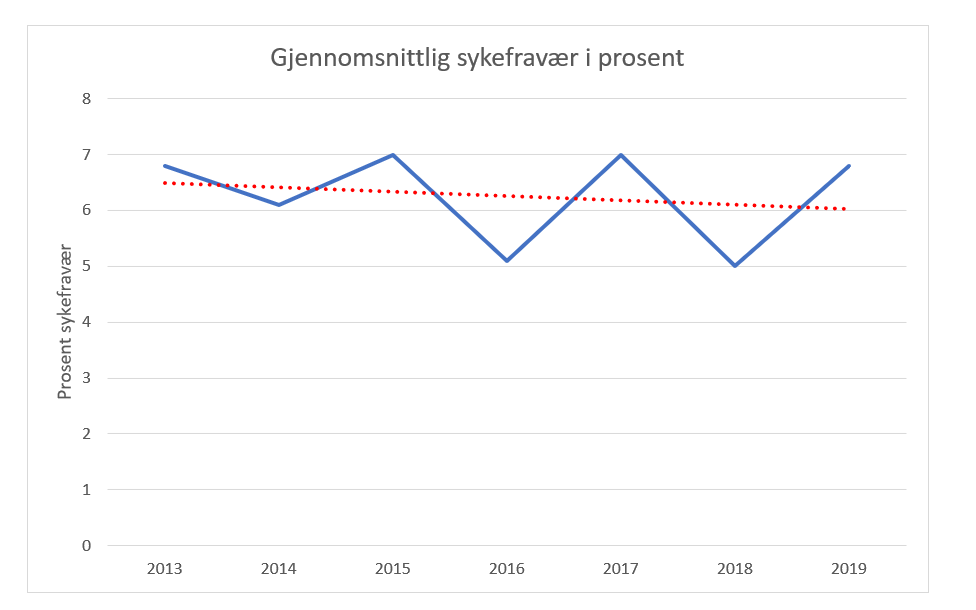

# Store datasett
(s131 i læreboka)

- "Utforsk sammen" - 45 min
(finne ulike datasett og hvilke formater de har)

- Evt undersøke sammen hva de ulike _filtypene_ betyr.

- Når vi undersøker et tallmateriale:
    - Vær obs på feilregistrereinger (kulde/is som forstyrrer målinger +++)
    - Komma eller punktum som desimalskiller?
    - Tallformat 3.456 er det 3,456 eller 3 456??
    - Skilletegn mellom kolonner; f.eks. CSV (comma separated values) eller semikolon…
    - Se på eksempel 12 s 134 sammen
    - s 134 --> søylediagram med klassebredder. Programmeres i excel GJØRE DE TO SIDENE!! (sjekk hver enkelt: hva er forskjellen mellom histogram og søylediagram??)

s136 Å se den underliggende trenden  
- hva ligger bak tallla? 
- sesongvariasjoner (salgstall før jul f.eks), vær, ferier, sykdom (influensasesong)
- Trendlinje --> se diagram (går mye opp og ned, men trendlinja viser nedgang i perioden)

s137/138  
Velg tre oppgaver som du løser.

  

### Trendlinje
